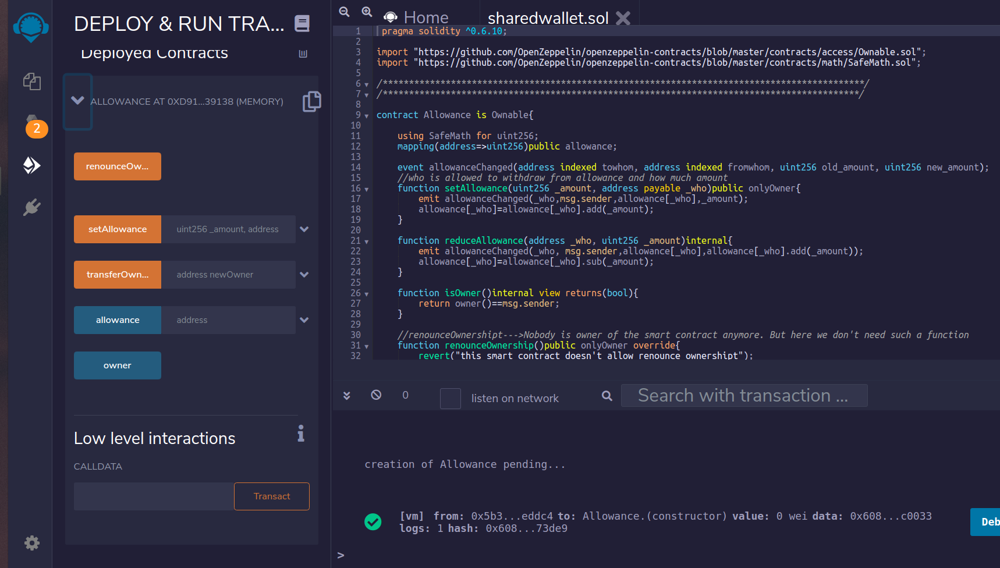

# sharedWallet
Shared wallet utility to manage ether distribution and transactions from allowance balance.

•On-chain wallet smart contract 
•Store funds and let users withdraw again 
•Give “allowance” to other, specific user-addresses. Eg. children, employees 

